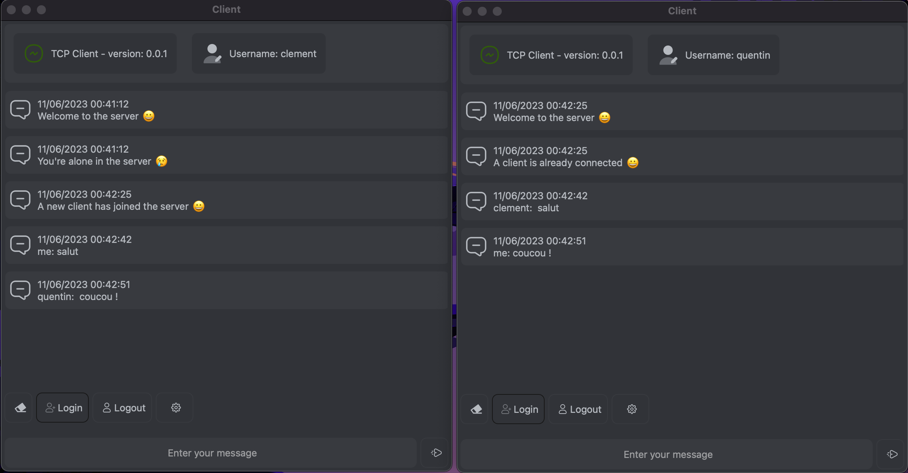

# TCP Server

This project provide:
- TCP server
- GUI client

100% Python project in Qt for GUI

The TCP client (last updated on 4/06/2023):

## Configuration
create virtual env:
 - mkdir .venv
 -  python3 -m venv .venv

Activate the virtualenv:
- source ./.venv/bin/activate

for installating dependencies (need to be in the venv):
 - pip install -r requirements.txt
 
## Launch project
Launch the server:
- python src/launch_server.py

Launch a client:
- python src/launch_client.py

